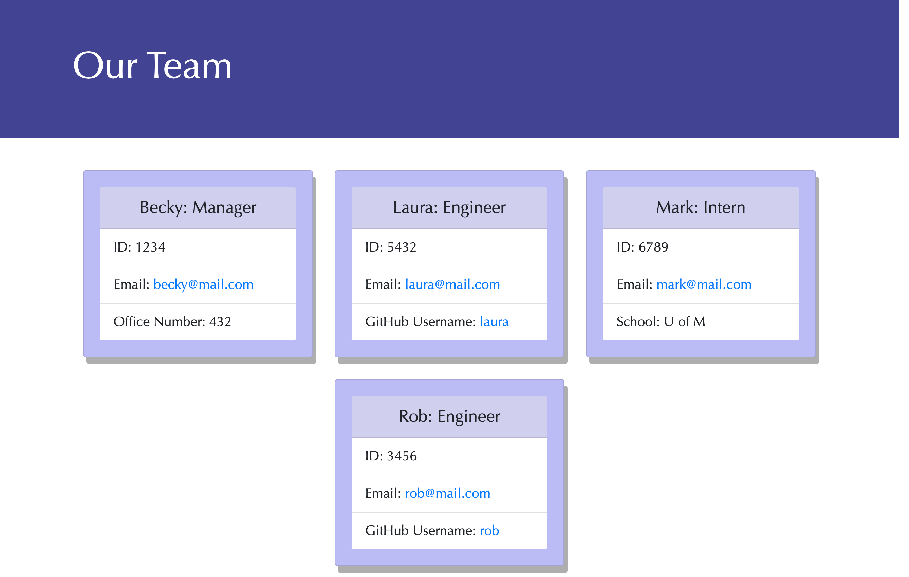

# Team Profile Generator

## Objectives
Build a Node.js command-line application that takes in information about employees and generates an HTML page with summaries for each employee. 

## Usage
[Watch the demonstration](https://drive.google.com/file/d/1DjSro1Q6jvK5hO03KOdtskDtBgVv7WaV/view)

## Link to GitHub Repo
[Link to the Github Repo](https://github.com/erikaosterbur/team-profile-generator.git)

## Screenshot

